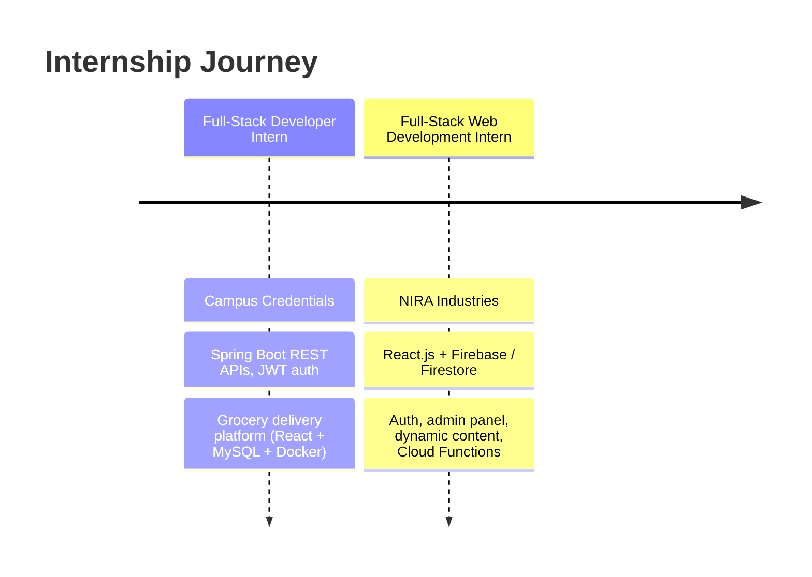
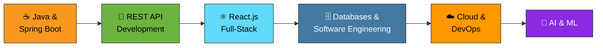

<!-- ===================== HEADER ===================== -->

  

 

 

<!-- ===================== ABOUT ===================== -->
<h2 align="center">👨‍💻 About Me</h2>

<table align="center">
<tr>
<td width="55%" valign="top">

I'm **Jagdish**, a final-year **B.Tech Computer Engineering** student at **MIT Academy of Engineering, Pune** (Class of 2027).

I love turning ideas into **practical, scalable web applications** — from clean REST APIs on the backend to smooth interfaces on the frontend — and I'm increasingly drawn to **DevOps, cloud and AI/ML**.

- 🎓 B.Tech Computer Engineering — MITAOE, Pune
- 💻 Backend-leaning **Full-Stack Developer**
- 🌱 Currently working with **Java, Spring Boot, React.js & databases**
- 🧩 Solved **369+ problems** on LeetCode
- ☁️ **AWS Certified Cloud Practitioner**
- 🏆 Selected for **Super-30** technical training at MITAOE
- 👥 Executive Member — **ACM Student Chapter, MITAOE**
- 🔬 Exploring **AI & Machine Learning**

</td>
<td width="45%" align="center" valign="middle">

</td>
</tr>
</table>

<!-- ===================== TECH STACK ===================== -->
<h2 align="center">🛠️ Tech Stack</h2>

**💻 Languages**

**⚙️ Backend**

**🎨 Frontend**

**🗄️ Databases**

**☁️ Cloud, DevOps & Tools**

<b>📋 Full skills list (click to expand)</b>

 

| Area | Skills |
|------|--------|
| **Languages** | Java, C++, JavaScript, Python, SQL |
| **Backend** | Spring Boot, REST APIs, JPA/Hibernate, JWT, FastAPI |
| **Frontend** | React.js, HTML5, CSS3, Tailwind CSS, Vite |
| **Databases** | MySQL, MongoDB, Firebase, Firestore |
| **Cloud & DevOps** | AWS, Docker, Jenkins, Git, GitHub |
| **AI / ML** | LSTM, XGBoost, CNN, ResNet50, U-Net, YOLO, RAG, ChromaDB |

<!-- ===================== PROJECTS ===================== -->
<h2 align="center">🚀 Featured Projects</h2>

<table>
<tr>
<td width="50%" valign="top">

### 🏨 StayLio
**Hotel Booking & Management Platform**

Full-stack platform with role-based access for **users, hotel owners and admins**.

`Java` `Spring Boot` `React.js` `MySQL` `JPA/Hibernate` `JWT` `Docker` `Jenkins`

</td>
<td width="50%" valign="top">

### 🛒 Grocito
**Grocery Delivery System**

Grocery delivery app with backend REST APIs and role-based functionality.

`Java` `Spring Boot` `React.js` `MySQL` `REST APIs`

</td>
</tr>
<tr>
<td width="50%" valign="top">

### 📊 Project Monitoring & Productivity Analytics
Manage projects and tasks with **real-time** activity and productivity insights.

`Java` `Spring Boot` `React.js` `MongoDB` `WebSocket` `Docker`

</td>
<td width="50%" valign="top">

### 🌊 AquaAlert
**Urban Flood Risk Prediction**

AI-based early-warning system exploring rainfall forecasting, environmental factors and computer vision.

`Python` `LSTM` `XGBoost` `ResNet50` `U-Net` `Grad-CAM`

</td>
</tr>
<tr>
<td width="50%" valign="top">

### 👁️ AI-Based Glaucoma Detection
Deep learning research on glaucoma detection from **retinal fundus images** — classification and segmentation.

`Python` `Deep Learning` `CNN` `YOLO` `U-Net`

</td>
<td width="50%" valign="top">

### 🤖 RAG Chatbot Microservice
Retrieval-Augmented Generation **document search** microservice with a vector database.

`Python` `FastAPI` `RAG` `ChromaDB` `REST API`

</td>
</tr>
</table>

<!-- ===================== EXPERIENCE ===================== -->
<h2 align="center">💼 Experience</h2>

<table>
<tr>
<td width="50%" valign="top">

#### 🏢 Full-Stack Web Developer Intern — Campus Credentials
Built backend **REST APIs with Spring Boot**, integrated databases, authentication and the React frontend for a grocery delivery platform.

`Java` `Spring Boot` `Hibernate/JPA` `MySQL` `React.js` `JWT` `Docker`

</td>
<td width="50%" valign="top">

#### 🏢 Full-Stack Web Development Intern — NIRA Industries
Worked on **React.js + Firebase** — authentication, database integration, admin functionality and dynamic content management.

`React.js` `Firebase` `Firestore` `Cloud Functions` `Vite` `Vercel`

</td>
</tr>
</table>

<!-- ===================== ACHIEVEMENTS ===================== -->
<h2 align="center">🏆 Achievements & Certifications</h2>

 

  

<!-- ===================== STATS ===================== -->
<h2 align="center">📊 GitHub Stats</h2>

 

 

<!-- ===================== ROADMAP ===================== -->
<h2 align="center">📚 Learning Roadmap</h2>

I'm continuously improving my **DSA, backend development, software engineering fundamentals, system design and problem-solving** skills.

<!-- ===================== GOALS ===================== -->
<h2 align="center">🎯 Goals</h2>

- [ ] 📌 Strengthen Data Structures and Algorithms
- [ ] 📌 Master backend development with Spring Boot
- [ ] 📌 Build stronger software engineering fundamentals
- [ ] 📌 Learn system design fundamentals
- [ ] 📌 Explore cloud-native technologies
- [ ] 📌 Contribute to open-source projects
- [ ] 📌 Keep exploring AI and Machine Learning
- [ ] 📌 Build and deploy practical applications

<!-- ===================== CONNECT ===================== -->
<h2 align="center">🤝 Let's Connect</h2>

**Open to internships, collaborations and interesting projects — say hi!**

  

### ⭐ Thanks for visiting my profile!

